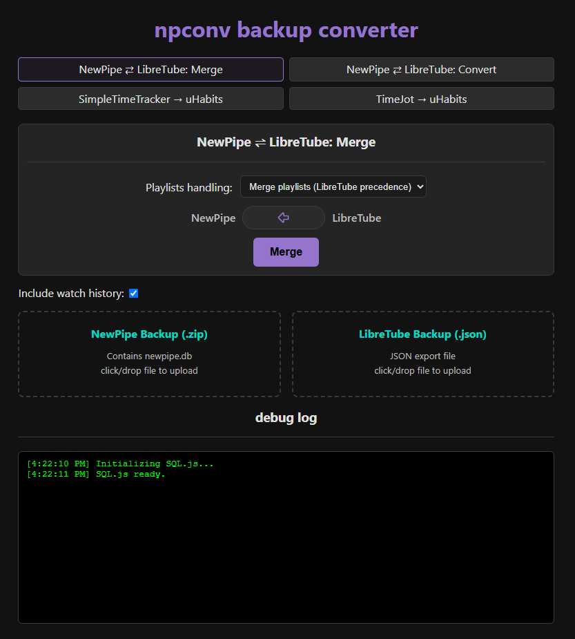
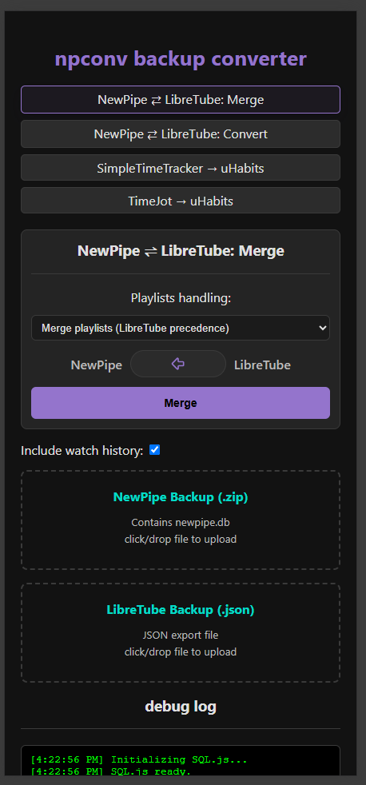
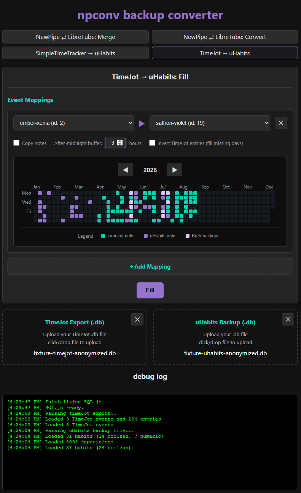

## npconv backup converter
On-device backup converter.  
> \>\>\> [Go to npconv](https://kraxen72.github.io/npconv/) <<<  
  
Started out as a way to convert between [NewPipe](https://github.com/TeamNewPipe/NewPipe) and [LibreTube](https://github.com/libre-tube/LibreTube) backups, but now supports:
- [NewPipe](https://github.com/TeamNewPipe/NewPipe) ⇄ [LibreTube](https://github.com/libre-tube/LibreTube): Merge and Convert
- [SimpleTimeTracker](https://github.com/Razeeman/Android-SimpleTimeTracker) → [uHabits](https://github.com/iSoron/uhabits)
- [TimeJot](https://timejot.app) → [uHabits](https://github.com/iSoron/uhabits)

_Conversion happens entirely in browser due to `sql.js`'s wasm implementation of sqlite._  

## NewPipe and LibreTube

  
  

- If you have used both apps in the past, for best results, use the `Merge` option.
  - I have tested the tool both ways and it worked for me fine.  
- If you have duplicate playlists in LibreTube after importing a backup, go to `App Info`, clear all data, and re-import to fix.  

### Usage Example
E.g. If you used newpipe up until 6 months ago, then used libretube from then until now, and are going back to newpipe:
1. select `Merge`
2. Load your 6-months-old newpipe backup
3. load your current, latest libretube export
4. click `Merge into NewPipe`

## uHabits (Loop Habit Tracker) backfill

  

1. Export the source data from Simple Time Tracker (`.backup`) or TimeJot (`.db`).
2. Create a Loop Habit Tracker database backup (`.db`).
3. Select the matching route and upload both files.
4. Map source activities/events to boolean or numeric habits. Numeric mappings use a custom value per source day; mappings to the same numeric habit and day are added together.
5. Review the source, existing, overlap, and new-day counts before creating the filled backup.

_Existing Loop Habit entries are never overwritten._

### Disclaimer
> **Always make backups before attempting any operation!**    
>   
> This tool still experimental.   
> It works well for the stuff I tested it on, but I am not responsible for corrupted backups, invalid app states or crash-loops that happen as a result of using this.  
> Always make and keep backups, so that if something goes wrong, you can clear the app data and restore to a known-good state.

### Reporting Issues
If you encounter any issues, and you'd like them see fixed:
1. best way is to open a pull request fixing the issue.
2. alternatively, open an issue including **both** your backup files (you may redact them as much as you want)
  
I cannot promise when they will be fixed for option 2), so option 1) is preferred.  
